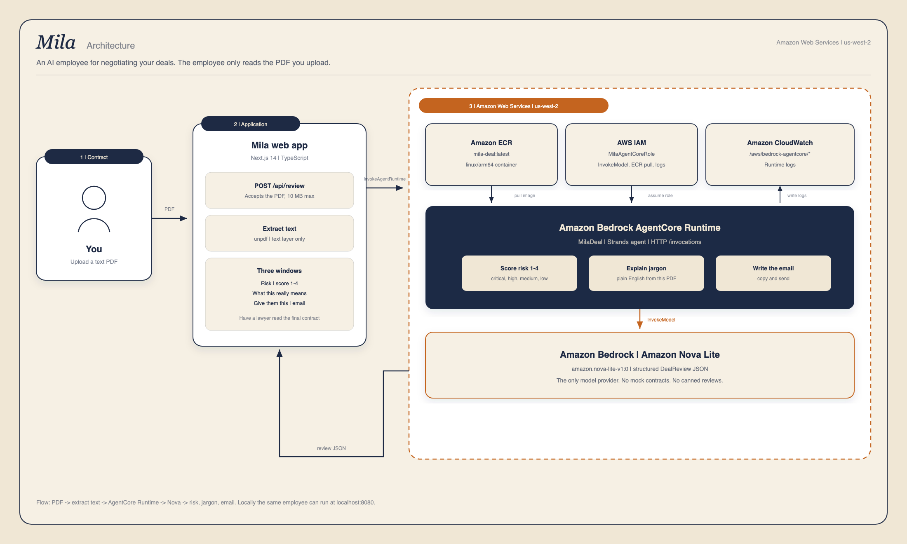

# Mila

Mila is an AI employee for negotiating your deals. You upload a contract, and she scores the risk, explains the jargon in normal English, and writes a negotiable email with the terms to change.

She runs on Amazon Bedrock AgentCore with Amazon Nova in us-west-2.

The three-page deck is here: [Mila slides](https://docs.google.com/presentation/d/16s8myj3d0BoquIzqkvhqgAnfVDgegZG0CH8duggGVzI/edit?usp=sharing).

## Why we built it

Many people lose great edges, and talks, on deals because of hidden jargon they never understood. The other side writes the contract in language that sounds ordinary, and the person who is supposed to agree does not see what they are giving away until it is too late. That is how people lose money, property, and wealth on terms they would have fought if someone had said them in plain English.

Mila exists so you can see that risk before you sign. She reads the PDF, scores how bad it is, explains the jargon, and writes a negotiable email with the terms to change.

## Architecture

You upload a text PDF. The Next.js app extracts the text and calls Amazon Bedrock AgentCore Runtime. The MilaDeal employee scores the risk, explains the jargon, and writes the negotiation email, using Amazon Nova Lite on Amazon Bedrock in us-west-2. Amazon ECR holds the ARM64 image, IAM is the execution role, and CloudWatch takes the runtime logs.



## Run locally

Copy `.env.example` to `.env.local` and fill in `AWS_ACCESS_KEY_ID` and `AWS_SECRET_ACCESS_KEY`. Then run:

```bash
npm install
npm run agentcore:dev
npm run dev
```

Keep `AGENTCORE_RUNTIME_URL=http://localhost:8080` in `.env.local`, then open http://localhost:3000 and upload a text PDF.

There is an optional mock walkthrough on the desk. Turn it on if Amazon Bedrock is still waiting on AWS Support (this account is on credits and the live runtime is held). The mock only fills the three windows so you can see the product. It is not a review of a real contract. The real employee is wired to AgentCore and Nova and should run as soon as AWS authorizes the account.

## Deploy

See [AGENTCORE_DEPLOY.md](AGENTCORE_DEPLOY.md).

## Docs

- [Testing_Instructions.md](Testing_Instructions.md)
- [SECURITY.md](SECURITY.md)
- [CONTRIBUTING.md](CONTRIBUTING.md)
- [CHANGELOG.md](CHANGELOG.md)
- [AUDIT.md](AUDIT.md)
- [LICENSE](LICENSE)
